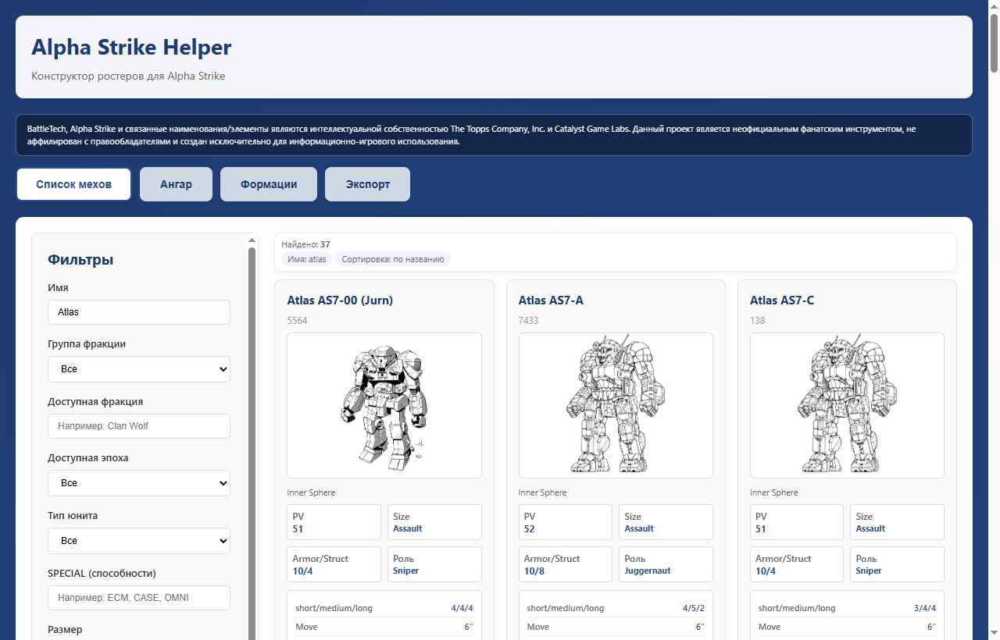
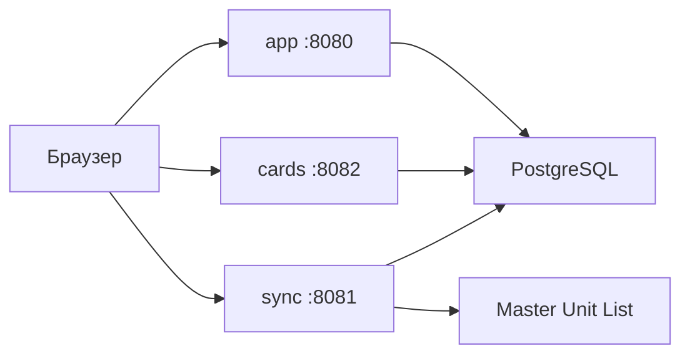

# Alpha Strike Helper

Веб-приложение для подготовки состава к партии в настольной тактике BattleTech: Alpha Strike.

Пользователь отбирает юниты по фракции, эпохе и роли, собирает отряд и должен уложиться в лимит очков. Сервис заменяет ручную сверку справочников: хранит каталог карточек, формирует ростер и до начала игры показывает, где состав расходится с правилами.



**Автор:** Мишкин Артём Дмитриевич · версия 0.9.2

## Возможности

- Поиск и фильтрация каталога карточек
- Сборка ростера и формаций Lance, Star, Level и Century
- Предварительная проверка состава: эпоха, фракция, лимит очков, размер и правила формации, рекомендации по замене
- Личные коллекции, регистрация и авторизация по JWT
- Обновление справочника из официального каталога Master Unit List
- Экспорт и печать карточек

## Архитектура

Интерфейс обращается к трём сервисам с общей базой PostgreSQL. Сервис синхронизации дополнительно загружает карточки из внешнего каталога Master Unit List.



| Сервис | Порт | Назначение |
| --- | --- | --- |
| app | 8080 | Интерфейс и API: пользователи, коллекции, ростер, формации |
| cards | 8082 | Поиск и выдача карточек, редактирование справочника |
| sync | 8081 | Загрузка данных из Master Unit List, статус и запуск по запросу |
| PostgreSQL | 5432 | Пользователи, карточки, коллекции, формации |

Доступность юнита по фракциям и эпохам хранится в JSONB.

Основное приложение разделено на слои: HTTP-обработчики на Gin, бизнес-логика (правила, расчёт очков, проверка комплектности) и доступ к данным через GORM. Авторизация JWT, CORS и журналирование вынесены в middleware. Импорт справочника выполняется разово или по расписанию отдельными утилитами. Окружение разворачивается через Docker Compose.

## Стек

Go 1.24 · Gin · GORM · PostgreSQL 16 · JWT · Docker Compose · HTML, CSS, JavaScript

## Структура

```text
cmd/server                 основное приложение
cmd/cards_service          сервис карточек
cmd/sync_service           сервис синхронизации
cmd/masterunitlist_sync    разовый импорт
cmd/weekly_sync            импорт по расписанию
internal/handler           HTTP-обработчики
internal/service           бизнес-логика
internal/repository        доступ к PostgreSQL
internal/domain            модели
internal/middleware        JWT, CORS, журналирование
internal/sync              клиент и импорт Master Unit List
pkg                        конфигурация, подключение к базе, JWT
templates, static          интерфейс
docker                     Docker Compose и образы сервисов
```

## Запуск

Нужны Docker и файл окружения по образцу `.env.example` (`DB_HOST`, `DB_PORT`, `DB_USER`, `DB_PASSWORD`, `DB_NAME`, `SERVER_PORT`, `JWT_SECRET`).

```text
docker compose -f docker/docker-compose.yml up -d --build
```

Интерфейс открывается по адресу `http://localhost:8080`.

Без Docker достаточно установленного Go 1.24+ и PostgreSQL. После настройки переменных окружения:

```text
go run ./cmd/server
go run ./cmd/sync_service
go run ./cmd/cards_service
```

Параметры API, сценарии импорта и детали реализации собраны в [WORK_DESCRIPTION.md](WORK_DESCRIPTION.md).
