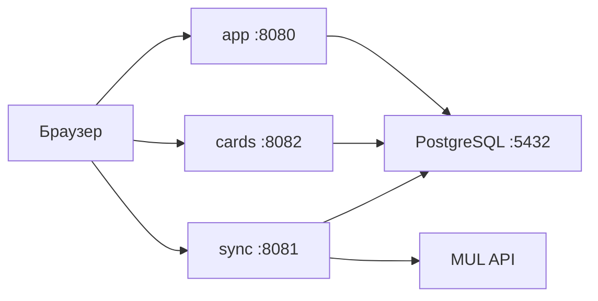

# Alpha Strike Helper

**Вид документа:** объединённый текст **технического задания** и **описания программы** для программного изделия «Alpha Strike Helper», оформленный с учётом требований к содержанию разделов по **ГОСТ 19.201-78** «Единая система программной документации. Техническое задание. Требования к содержанию и оформлению» и **ГОСТ 19.402-78** «Единая система программной документации. Описание программы».

Расширенное описание реализации, параметров API и сценариев эксплуатации — в файле `WORK_DESCRIPTION.md` (рекомендуется рассматривать как **приложение** к настоящему документу).

---

# Часть 1. Техническое задание (ГОСТ 19.201-78)

## 1. Введение

### 1.1. Наименование программы

**Alpha Strike Helper** — веб-приложение (программное изделие) для создания и управления игровыми карточками **BattleTech: Alpha Strike** с поддержкой **предигровой валидации** ростеров и формаций.

### 1.2. Краткая характеристика области применения

Игровая и организационная деятельность, связанная с подбором юнитов по характеристикам, формированием ростеров и тактических формаций типов **Lance / Star / Level / Century** (в т.ч. для **Marian Hegemony** — формации **Century** из пяти юнитов), расчётом суммарных показателей, подготовкой данных к экспорту и печати, а также актуализацией справочника карточек по данным официального каталога **Master Unit List (MUL)**.

### 1.3. Объект, в котором используется программа

Персональные электронные вычислительные машины и серверы заказчика (разработчика), оснащённые браузером и (или) средой исполнения серверных компонентов; локальная сеть или сеть Интернет при размещении сервисов на узле сети.

---

## 2. Основания для разработки

### 2.1. Документы и основания

Разработка выполняется по инициативе разработчика в рамках учебного/проектного задания и практической потребности в инструменте автоматизации работы с ростерами и справочником юнитов BattleTech: Alpha Strike.

### 2.2. Наименование и условное обозначение темы разработки

- **Наименование темы:** фронтенд- и бэкенд-разработка веб-приложения для создания и управления игровыми карточками BattleTech: Alpha Strike с возможностью предигровой валидации.  
- **Условное обозначение:** программный модуль репозитория `Alpha_Strike_Helper` (язык Go, модуль `Alpha_Strike_Helper` согласно `go.mod`).

---

## 3. Назначение разработки

### 3.1. Функциональное назначение

Обеспечить пользователю возможности: просмотра и поиска карточек в каталоге; ведения ростера; формирования и редактирования формаций **Lance / Star / Level / Century**; **предигровой валидации** состава и ограничений (в объёме реализованной логики клиента и сервера); расчёта агрегированных показателей (включая PV); экспорта и подготовки к печати; импорта и обновления набора карточек из MUL (CLI и/или отдельный sync-сервис); при необходимости — работы с пользовательскими коллекциями и защищёнными маршрутами API на базе JWT.

### 3.2. Эксплуатационное назначение

Программа эксплуатируется как клиент–серверное веб-приложение: клиент — браузер пользователя; сервер — один или несколько процессов на ОС типа Linux или Microsoft Windows, взаимодействующих с СУБД PostgreSQL и (при импорте) с внешним HTTP API MUL.

---

## 4. Требования к программе или программному изделию

### 4.1. Требования к функциональным характеристикам

#### 4.1.1. Требования к составу выполняемых функций

Программа должна обеспечивать (в объёме текущей версии изделия):

- каталог карточек с пагинацией, поиском и фильтрацией (в т.ч. по фракции, эпохе, типу юнита, роли, PV и др.);
- операции с ростером и формациями **Lance / Star / Level / Century** (создание, изменение, удаление; для фракции **Marian Hegemony** — формации **Century** на **пять** юнитов по правилам Alpha Strike; проверки комплектности и правил — в реализованном объёме);
- подсистему регистрации/входа и выдачу JWT для защиты части API;
- импорт данных из MUL (разовый и периодический CLI, HTTP API sync-сервиса);
- выдачу данных по карточкам через отдельный cards-сервис, используемый UI;
- экспорт данных и подготовку к печати карточек средствами браузера.

#### 4.1.2. Требования к организации входных и выходных данных

- **Входные данные:** HTTP-запросы с параметрами и телом в формате JSON (и формы HTML там, где применимо); параметры CLI импорта; переменные окружения конфигурации; данные из PostgreSQL и внешнего API MUL при синхронизации.  
- **Выходные данные:** HTML-страницы UI, ответы REST API в JSON, потоки логов; при ошибках — коды состояния HTTP и структурированные сообщения об ошибках в объёме реализации.

#### 4.1.3. Требования к временным характеристикам

Отклик типовых операций UI и API должен быть приемлемым для интерактивной работы при номинальной нагрузке (один пользователь или ограниченная группа); при массовом импорте из MUL допускается увеличение длительности операций, компенсируемое настройкой таймаутов (см. `WORK_DESCRIPTION.md`).

### 4.2. Требования к надёжности

Обеспечение сохранности данных в PostgreSQL; использование транзакций и согласованной логики изменения сущностей; обработка сетевых сбоев и ошибок с уведомлением пользователя; валидация данных на сервере; дополнительные проверки на клиенте — в объёме текущей версии.

### 4.3. Условия эксплуатации

- **Клиент:** браузеры Chrome, Firefox, Safari, Edge с поддержкой ECMAScript 2015+ и Fetch API.  
- **Сервер:** Linux (рекомендуется Ubuntu 20.04+, Debian 11+) или Windows 10/11 для разработки и тестового контура.  
- **Сеть:** использование портов по умолчанию **8080** (основное приложение), **8081** (sync-service), **8082** (cards-service), **5432** (PostgreSQL) при конфигурации из `docker/docker-compose.yml`.

### 4.4. Требования к составу и параметрам технических средств

| Компонент | Параметры |
|-----------|-----------|
| Язык серверной реализации | Go 1.24+ |
| HTTP API | фреймворк Gin |
| СУБД | PostgreSQL 14+ |
| Доступ к данным | GORM, драйвер PostgreSQL (pgx) |
| Клиент | HTML5, CSS3, JavaScript (без обязательного SPA-фреймворка) |
| Контейнеризация | Docker, Docker Compose (каталог `docker/`) |

### 4.5. Требования к информационной и программной совместимости

Взаимодействие клиента и сервера по протоколу HTTP; обмен в формате JSON; для защищённых маршрутов — JWT (RFC 7519); настройка CORS по политике развёртывания.

### 4.6. Требования к маркировке и упаковке

К программному изделию, поставляемому в виде исходных кодов и контейнерных образов, **требования к маркировке и упаковке не предъявляются**. Версия изделия фиксируется в системе контроля версий и в настоящем документе.

### 4.7. Требования к транспортированию и хранению

**Не предъявляются** (дистрибуция электронным способом). Рекомендуется хранение репозитория на носителе заказчика с резервным копированием.

### 4.8. Специальные требования

Исходные коды должны собираться стандартным инструментарием Go; конфиденциальные параметры (ключ JWT, пароли СУБД) задаются через переменные окружения и не включаются в репозиторий.

---

## 5. Требования к программной документации

Состав программной документации по изделию:

- настоящий файл `README.md` (ТЗ и описание программы);
- файл `WORK_DESCRIPTION.md` (детализация архитектуры, API, запуска, импорта);
- комментарии в исходном коде по нетривиальным фрагментам;
- файлы конфигурации сборки и развёртывания в репозитории (`docker/`, `go.mod`).

---

## 6. Технико-экономические показатели

Ориентир: сокращение времени ручного подбора юнитов и проверки ростера по сравнению с работой только с печатными источниками и разрозненными файлами; снижение числа ошибок при формировании состава за счёт автоматизированных проверок в объёме реализованной логики. Точные нормативы экономии труда в настоящем документе **не нормируются**.

---

## 7. Стадии и этапы разработки

Выполнены: проектирование архитектуры и схемы данных, реализация основного сервера, микросервисов cards и sync, клиентской части, модуля импорта MUL, базовая документация. В процессе или планируются: расширение автоматизированного тестирования, доработка производительности и регрессионного покрытия (подробности — в `WORK_DESCRIPTION.md`).

---

## 8. Порядок контроля и приёмки

Приёмка включает проверку:

- работоспособности сценариев: каталог и фильтры, ростер, формации **Lance / Star / Level / Century** (включая Marian Hegemony / Century), экспорт/печать, импорт (при доступности MUL);
- запуска состава сервисов через `docker-compose -f docker/docker-compose.yml`;
- наличия и актуальности инструкций в `WORK_DESCRIPTION.md`.

---

## 9. Приложения к техническому заданию

- **Приложение А:** файл `WORK_DESCRIPTION.md` — дополнительное описание программы, сервисов, параметров импорта и API.

---

## Титульные сведения (исполнитель, версия)

| Поле | Значение |
|------|----------|
| Разработчик | Мишкин Артём Дмитриевич |
| Версия программного изделия | 0.9.2 |
| Дата актуализации документа | 12 мая 2026 г. |

---

# Часть 2. Описание программы (ГОСТ 19.402-78)

## 1. Общие сведения

### 1.1. Полное наименование программы

**Alpha Strike Helper** — веб-приложение для поддержки игроков настольной игры BattleTech: Alpha Strike при работе с карточками юнитов, ростерами и формациями.

### 1.2. Программное обеспечение, необходимое для работы программы

- на узле сервера: ОС Linux или Microsoft Windows, среда выполнения контейнеров Docker (рекомендуется) либо установленные компилятор/рантайм **Go 1.24+** и **PostgreSQL 14+**;
- на узле клиента: веб-браузер с поддержкой JavaScript (ES6+) и Fetch API.

### 1.3. Языки программирования

Go (сервер, CLI, микросервисы), JavaScript, HTML, CSS.

### 1.4. Сведения об объёме программы

Объём измеряется составом модулей репозитория; исполняемые компоненты располагаются в каталоге `cmd/` (логическая декомпозиция — в разделе 3 настоящей части).

---

## 2. Функциональное назначение

Программа относится к классу **информационно-справочных и планирующих** систем для предметной области настольных тактических игр.

**Назначение:** предоставление пользователю средств просмотра каталога карточек с фильтрацией, ведения ростера, сборки формаций **Lance / Star / Level / Century**, предигровой проверки состава, расчёта показателей в рамках реализованных правил, экспорта и печати, а также загрузки и обновления справочника карточек из Master Unit List.

**Функциональные ограничения:** программа не заменяет официальные издания правил BattleTech; полнота игровых правил и справочников определяется загруженными в СУБД данными и реализованной бизнес-логикой. Часть пользовательских сценариев может выполняться без JWT (публичные маршруты), часть операций требует аутентификации — в соответствии с реализацией API.

---

## 3. Описание логической структуры

Программа строится по многоуровневой схеме: слой представления (HTML/JS в `templates` и `static`), слой HTTP-обработчиков (`internal/handler`), слой сервисов (`internal/service`), слой доступа к данным (`internal/repository`), доменные модели (`internal/domain`), модуль синхронизации с MUL (`internal/sync`), вспомогательные пакеты (`pkg`).

### 3.1. Состав компонентов и связи между ними

| Компонент репозитория | Назначение |
|-----------------------|------------|
| `cmd/server` | основной веб-сервер и API |
| `cmd/cards_service` | микросервис карточек (чтение, поиск, админ CRUD, chassis-sources) |
| `cmd/sync_service` | микросервис управления импортом из MUL |
| `cmd/masterunitlist_sync` | CLI однократного импорта |
| `cmd/weekly_sync` | CLI периодической синхронизации |
| `internal/domain` | модели предметной области |
| `internal/repository` | GORM, PostgreSQL |
| `internal/service` | бизнес-логика |
| `internal/handler` | маршруты Gin |
| `internal/middleware` | CORS, JWT, логирование |
| `internal/sync` | клиент и логика MUL |
| `pkg` | конфигурация, БД, JWT |



---

## 4. Используемые технические средства

- **ЭВМ сервера:** IBM PC-совместимая архитектура или иная, поддерживаемая ОС Linux/Windows и Docker.  
- **ЭВМ клиента:** устройство с браузером и дисплеем.  
- **Сеть:** Ethernet/Wi‑Fi; протокол TCP/IP, прикладной уровень HTTP.  
- **СУБД:** PostgreSQL.

---

## 5. Вызов и загрузка

### 5.1. Способ вызова (развёртывание через Docker Compose)

```text
docker-compose -f docker/docker-compose.yml up -d --build
```

При использовании плагина Compose v2 допустимо: `docker compose -f docker/docker-compose.yml up -d --build`.

**Точки входа пользователя:** URL веб-интерфейса основного приложения (по умолчанию `http://localhost:8080`); обращения UI к сервисам на портах **8082** (карточки) и **8081** (синхронизация) — в соответствии с конфигурацией фронтенда.

### 5.2. Способ вызова (без Docker)

После настройки PostgreSQL и переменных окружения (`DB_HOST`, `DB_PORT`, `DB_USER`, `DB_PASSWORD`, `DB_NAME`, `SERVER_PORT`, `JWT_SECRET` и др. по `pkg`/конфигурации):

```text
go run ./cmd/server
go run ./cmd/sync_service
go run ./cmd/cards_service
```

### 5.3. Загрузка данных из MUL (пример CLI)

```text
go run ./cmd/masterunitlist_sync --unit-type-id=18 --replace=true --include-faction-eras=true --era-ids=13,247,14
```

Полный перечень ключей — в `WORK_DESCRIPTION.md`.

---

## 6. Входные данные

| Источник | Характер и формат |
|----------|-------------------|
| Пользователь (браузер) | HTTP GET/POST; параметры строки запроса; тело JSON для API; данные форм HTML |
| Файлы конфигурации / ОС | переменные окружения для подключения к БД, портов, секретов JWT |
| СУБД | строки и бинарные поля таблиц PostgreSQL; поля JSONB для доступности фракций/эпох у карточек |
| Внешняя система MUL | ответы HTTP API (JSON/XML в объёме клиента импорта) |

---

## 7. Выходные данные

| Потребитель | Характер и формат |
|-------------|-------------------|
| Браузер | HTML-страницы, статические ресурсы, исполняемый в браузере JavaScript |
| Клиент API | JSON-ответы REST; коды состояния HTTP |
| СУБД | изменённые строки таблиц после транзакций |
| Пользователь (печать) | данные, подготовленные для диалога печати браузера |
| Логи | текстовые сообщения процессов сервера и сервисов |

При ошибках выходные данные включают код ошибки HTTP и, при наличии, тело с описанием ошибки в формате JSON.

---

## Приложение Б. Перечень использованных нормативных документов и ссылок

1. ГОСТ 19.201-78. Единая система программной документации. Техническое задание. Требования к содержанию и оформлению.  
2. ГОСТ 19.402-78. Единая система программной документации. Описание программы.  
3. Документация Go: https://go.dev/doc/  
4. Документация Gin: https://gin-gonic.com/docs/  
5. Документация PostgreSQL: https://www.postgresql.org/docs/  

---
