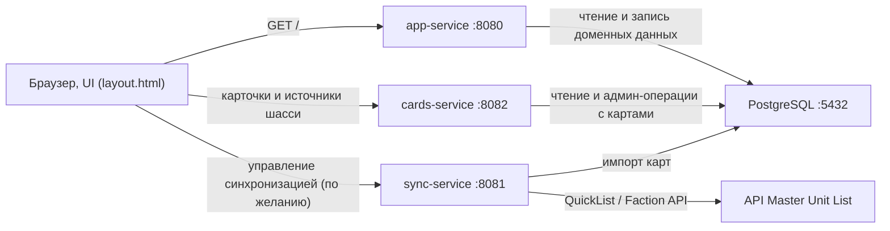
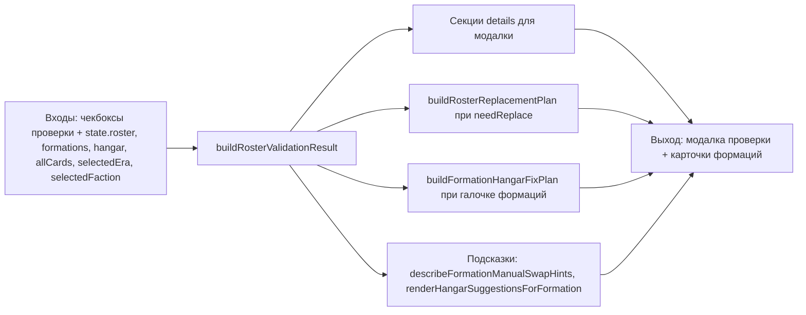
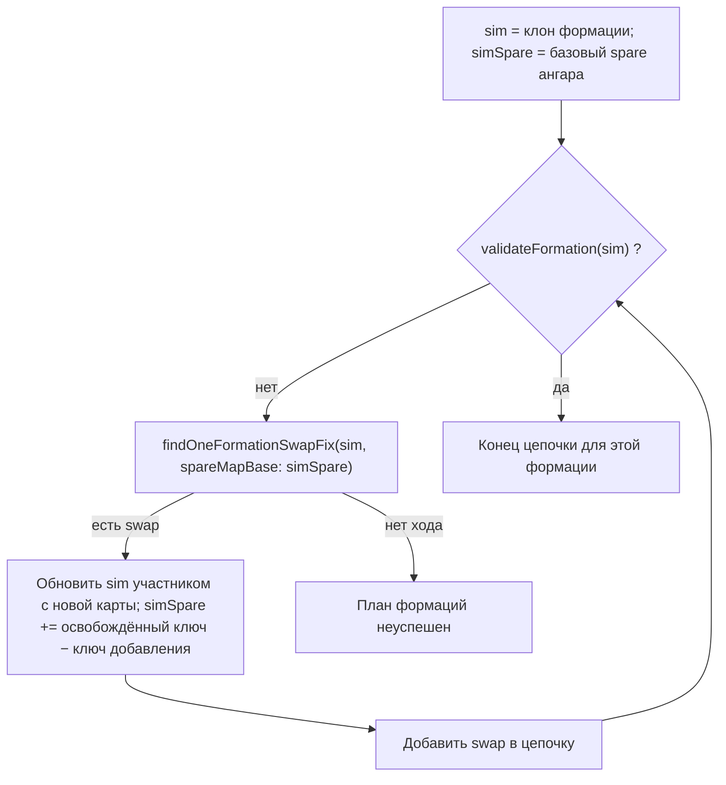

# Описание выполненных работ по приложению Alpha Strike Helper

## 1. Цель приложения

Разработано веб-приложение для управления карточками юнитов BattleTech: Alpha Strike, формирования отрядов и формаций (**Lance / Star / Level / Century**), расчёта суммарных параметров, предигровой валидации и подготовки данных к экспорту/печати.

Основная задача приложения: упростить подбор юнитов, фильтрацию по характеристикам и сборку игровых формаций с проверкой ограничений.

## 2. Реализованная архитектура

Приложение разделено на несколько уровней:

- `internal/domain` — доменные модели (`Card`, `User`, `Collection`, `Lance`, `Star`).
- `internal/repository` — доступ к PostgreSQL через GORM.
- `internal/service` — бизнес-логика (авторизация, карточки, коллекции, расчёт статистики Lance / Star и валидация на сервере).
- `internal/handler` — HTTP-обработчики API на Gin.
- `internal/middleware` — middleware для CORS, JWT и логирования.
- `internal/sync` — модуль синхронизации внешних источников (в т.ч. Master Unit List: клиент, маппинг, импорт).
- `pkg` — инфраструктура (конфиг, подключение к БД, JWT-утилиты).
- `templates` / `static` — frontend часть на HTML/CSS/JavaScript.
- `cmd/*` — исполняемые команды:
  - `cmd/server` (web/API сервер),
  - `cmd/masterunitlist_sync` (ручной/разовый импорт),
  - `cmd/weekly_sync` (плановая периодическая синхронизация),
  - `cmd/sync_service` (микросервис sync с HTTP API),
  - `cmd/cards_service` (микросервис cards с read/admin API и chassis-sources).

### 2.1 Схема сервисов и портов



## 3. Backend и API

### 3.1 Авторизация и пользователи

Реализована backend-подсистема аутентификации (JWT):

- регистрация пользователя;
- вход пользователя;
- генерация JWT-токена;
- защита части API через JWT middleware (`/api/v1/collections`, `/api/v1/admin/cards`).

Примечание:

- ключевые пользовательские сценарии текущего UI (каталог карточек, ростер, формации **Lance / Star / Level / Century**) работают по публичным маршрутам и не требуют токена.

### 3.2 Карточки юнитов

Реализованы:

- получение списка карточек с пагинацией;
- фильтрация по параметрам;
- поиск по имени/модели;
- получение карточки по ID;
- админские операции CRUD (создание/редактирование/удаление).

### 3.3 Формации Lance / Star / Level / Century

Реализованы:

- создание и редактирование формаций (на стороне API — сущности **Lance** и **Star**; в UI дополнительно типы **Level** (ComStar / Word of Blake) и **Century** для **Marian Hegemony**, 5 юнитов);
- управление составом формаций;
- базовая валидация комплектности;
- расчет агрегированных характеристик;
- экспорт данных формаций.

### 3.4 Коллекции пользователя

Реализованы:

- создание пользовательских коллекций;
- добавление/удаление карточек в коллекциях;
- просмотр коллекций пользователя.

## 4. База данных и модели

Используется PostgreSQL + GORM AutoMigrate.

Основные таблицы:

- `users`
- `cards`
- `collections`
- `lances`
- `stars`
- таблицы участников формаций (`lance_members`, `star_members`)

Для карточек реализовано хранение как базовых характеристик Alpha Strike, так и расширенной информации по доступности:

- `available_factions` (JSONB массив),
- `available_eras` (JSONB массив),
- `faction_era_availability` (JSONB объект, соответствие фракций и эпох).

## 5. Импорт данных

### 5.1 Единоразовый импорт из Master Unit List

Добавлен отдельный CLI-импорт:

- `cmd/masterunitlist_sync`
- модуль: `internal/sync/masterunitlist`

Что делает:

- загружает карточки через `Unit/QuickList`;
- собирает доступность по эпохам (`AvailableEras`);
- собирает доступность по фракциям (`Factions`);
- опционально строит детализацию `фракция -> список эпох`;
- выполняет upsert/replace в таблицу `cards`.

### 5.2 Плановая синхронизация (еженедельная)

Добавлен отдельный CLI-процесс периодической синхронизации:

- `cmd/weekly_sync`

Что делает:

- запускает импорт по расписанию (`time.Ticker`);
- может выполнить синхронизацию сразу при старте (`--run-now=true`);
- использует тот же импортный модуль `internal/sync/masterunitlist`.

### 5.3 Sync Service (отдельный HTTP-процесс)

Добавлен отдельный микросервис синхронизации:

- `cmd/sync_service`
- orchestration-слой: `internal/sync/service`

HTTP-эндпоинты:

- `GET /health` — проверка состояния процесса;
- `GET /sync/status` — статус последнего запуска;
- `POST /sync/run` — ручной запуск импорта (асинхронно).

### 5.4 Cards Service (отдельный HTTP-процесс)

Добавлен отдельный микросервис карточек:

- `cmd/cards_service`

HTTP-эндпоинты:

- `GET /health`
- `GET /api/v1/cards`
- `GET /api/v1/cards/:id`
- `GET /api/v1/cards/search`
- `POST /api/v1/admin/cards`
- `PUT /api/v1/admin/cards/:id`
- `DELETE /api/v1/admin/cards/:id`
- `GET /api/v1/chassis-sources`

Примечание:

- frontend (`templates/layout.html`) получает карточки и `chassis_sources` напрямую из cards-service (`:8082`).

## 6. Обновления фильтрации API карточек

Добавлена поддержка фильтрации по новой структуре доступности:

- `faction` — работает по legacy-полю `faction` и по `available_factions`;
- `era` — работает по legacy-полю `era` и по `available_eras`;
- `available_faction` — фильтр только по `available_factions`;
- `available_era` — фильтр только по `available_eras`.

Это обеспечивает обратную совместимость и поддержку новых данных одновременно.

## 7. Frontend

Реализован интерфейс на Vanilla JS:

- каталог карточек;
- формации **Lance / Star / Level / Century**;
- модальные окна для CRUD операций;
- базовая интеграция с backend API;
- подготовка данных к печати/экспорту.

## 8. Инфраструктура и запуск

Реализованы:

- конфигурация через переменные окружения;
- Dockerfile для сборки и запуска приложения;
- подключение к PostgreSQL;
- автоматическая миграция схемы при старте.

## 9. Текущее состояние проекта

Проект в состоянии рабочего прототипа/предрелиза:

- backend и frontend работают в связке, ключевые пользовательские сценарии доступны;
- каталог карточек загружается полностью (с пагинацией), фильтры по фракции/группе/эпохе/типу работают;
- ростер, формации, ангар, печать/экспорт и блок `Где взять` реализованы и используются в UI;
- импорт из MUL работает как в ручном режиме (`masterunitlist_sync`), так и в периодическом (`weekly_sync`);
- данные и UI уже покрывают BattleMech + другие типы юнитов, включая правила по совместимости и валидации формаций.

Ограничения текущего этапа:


- автотесты и регрессионное покрытие пока неполные;

## 10. Рекомендуемые следующие шаги

1. Добавить автотесты для `repository/service` слоев и импортеров.
2. Описать API (включая новые query-параметры) в отдельной документации.
3. Подготовить полноценный `docker-compose.yml` (app + postgres).
4. Добавить сидирование/команды smoke-проверки после импорта.
5. Провести оптимизацию тяжелых запросов и индексацию (по необходимости).

## 11. Практическая эксплуатация (текущее состояние)

### 11.1 Быстрый запуск (Docker Compose)

Требования:

- Docker
- Docker Compose

Команды:

- `docker-compose -f docker/docker-compose.yml up -d --build`
- `docker-compose -f docker/docker-compose.yml logs -f app`
- `docker-compose -f docker/docker-compose.yml down`

После запуска:

- API: `http://localhost:8080`
- Sync Service API: `http://localhost:8081`
- Cards Service API: `http://localhost:8082`
- PostgreSQL: `localhost:5432`

### 11.2 Запуск без Docker

Необходим PostgreSQL и переменные окружения:

- `DB_HOST`
- `DB_PORT`
- `DB_USER`
- `DB_PASSWORD`
- `DB_NAME`
- `SERVER_PORT`
- `JWT_SECRET`

Команда запуска сервера:

- `go run ./cmd/server`

### 11.2.1 Запуск sync-сервиса без Docker

Команда запуска:

- `go run ./cmd/sync_service`

Доступные HTTP-эндпоинты:

- `GET /health`
- `GET /sync/status`
- `POST /sync/run`

Пример body для `POST /sync/run`:

```json
{
  "unit_type_ids": [18, 19, 17, 21],
  "replace_first": true,
  "include_faction_eras": true,
  "http_timeout_seconds": 180
}
```

### 11.2.2 Запуск cards-сервиса без Docker

Команда запуска:

- `go run ./cmd/cards_service`

### 11.3 Импорт карточек MUL (Master Unit List)

Основная команда:

- `go run ./cmd/masterunitlist_sync --unit-type-id=18 --replace=true --include-faction-eras=true --era-ids=13,247,14`

Ключевые параметры:

- `--unit-type-id=18` (BattleMech)
- `--replace=true|false` (пересоздавать набор карточек)
- `--include-faction-eras=true|false`
- `--era-ids=13,247,14` (ограничение эпох)
- `--faction-ids=24,29,27` (ограничение фракций)
- `--http-timeout=120s` (рекомендуется 180s+ при нестабильной сети)
- `--batch-size=300`

Примечание:

- если внешний сервис нестабилен на широких era-запросах, используйте режим эпоха -> фракция (в текущей реализации это основная стратегия заполнения доступности).

### 11.4 Новые поля карточки по доступности

В модели карточки используются:

- `available_factions` (`jsonb`, массив строк)
- `available_faction_groups` (`jsonb`, массив строк)
- `available_eras` (`jsonb`, массив строк)
- `faction_era_availability` (`jsonb` object)

### 11.5 Новые фильтры API `/api/v1/cards`

Поддерживаются query-параметры:

- `faction`
- `available_faction`
- `faction_group`
- `era`
- `available_era`
- `unit_type` (рекомендуемый)
- `type` (legacy-синоним)
- `role`
- `size`
- `techbase`
- `name`
- `pvmin`
- `pvmax`

Примеры:

- `/api/v1/cards?faction_group=HW Clan&available_era=Jihad`
- `/api/v1/cards?available_faction=Clan Wolf&era=Clan Invasion`

### 11.6 Защита от дублей

При импорте карточек:

- выполняется проверка дублей по `model_number` до и после импорта;
- при обнаружении дублей лишние строки удаляются;
- запись карточек идет через upsert по `model_number`.

## 12. Последние доработки (UI, логика ростера, импорт)

### 12.1 Каталог источников миниатюр (Sarna) и блок "Где взять"

Реализован полный цикл наполнения `static/data/chassis_sources.json` на основе списка Sarna (Miniatures - Catalyst Game Labs):

- собран и очищен каталог `шасси -> [коробки/паки]`;
- удалены технические артефакты парсинга (`[edit]`, заголовки секций, мусорные ключи);
- добавлены алиасы шасси (например, варианты `Timber Wolf/Mad Cat`);
- добавлена поддержка составных имен формата `Alias (Canonical)` (например, `Masakari (Warhawk)`, `Daishi (Dire Wolf)`);
- для `Elemental` поддержаны разные варианты написания (исключая `Water Elemental`);
- нормализованы названия источников;
- на карточках в разделе "Список мехов" отображается блок `Где взять: ...`.

### 12.2 Полная загрузка карточек на frontend

Исправлена загрузка карточек в UI:

- ранее использовалась только первая страница API (`page=1`);
- теперь `loadCards()` загружает **все страницы** (`page..total_pages`);
- это устранило ситуацию, когда в фильтрах отображались не все эпохи/данные.

### 12.3 Расширенная совместимость фракций через General

Добавлена логика совместимости `General`-фракций в пределах группы:

- `IS Clan General` считается доступной для всех фракций группы `IS Clan`;
- аналогично для `HW Clan General`, `Inner Sphere General`, `Periphery General` и т.д.;
- фильтрация, добавление в ростер и подсказки используют единую совместимость;
- выбор такого юнита не должен принудительно менять выбранную пользователем фракцию ростера.

### 12.4 Доступность юнита по фракциям и эпохам

В карточках списка добавлена кнопка `Доступность`:

- открывается модальное окно с матрицей `фракция × эпоха`;
- используется `faction_era_availability` и поля доступности карточки;
- в таблице применяется хронологическая сортировка эпох (не алфавит).

### 12.5 Эпохи и синхронизация фильтров "Список мехов" -> "Ростер"

Реализован перенос выбранной эпохи:

- эпоха из фильтра списка юнитов автоматически подставляется в `Ростер`;
- ручной выбор эпохи в `Ростере` имеет приоритет и не перезаписывается;
- при очистке ростера флаги ручного выбора сбрасываются.

Также эпохи в фильтрах и связанных селекторах отсортированы по хронологии:

- Star League
- Early Succession War
- Late Succession War - LosTech
- Late Succession War - Renaissance
- Clan Invasion
- Civil War
- Jihad
- Early Republic
- Late Republic
- Dark Age
- ilClan

### 12.6 Исключение юнитов с PV=0

На клиентской стороне добавлено исключение юнитов с `PV <= 0`:

- в каталоге карточек;
- в фильтрации списка;
- в поиске добавления в ростер.

### 12.7 Рефактор и доработка формаций Clan / IS / ComStar / Marian Hegemony

Обновлена логика формирования и выбора типов:

- для Clan добавлены Star-аналоги Lance-типов (`Battle Lance` → `Battle Star` и т.д.);
- для ComStar / Word of Blake — Level-аналоги (`Battle Lance` → `Battle Level` и т.д.; размер **6**);
- для **Marian Hegemony** — **Century**-аналоги (`Battle Lance` → `Battle Century` и т.д.; размер **5**, как у Star);
- размер Star- и Century-формаций зафиксирован как **5**;
- `Omni Star` удален из активных типов (и мигрируется в `Battle Star` для старых данных UI);
- исправлено определение стороны ростера с приоритетом выбранной фракции (например, `Clan Sea Fox`, **Marian Hegemony**);
- ограничено переполнение формации при drag&drop (проверка капа по размеру).

### 12.8 Skill юнитов (формации + печать)

Добавлена система `Skill` для юнитов:

- базовый skill = `4`;
- диапазон изменения skill: `0..8`;
- доступно изменение skill в блоке участника формации;
- PV юнита пересчитывается на основе базового PV и таблиц повышения/понижения skill;
- пересчитанный PV используется в:
  - карточке участника формации,
  - статистике ростера,
  - экспорте/preview,
  - печати карточек (`print`), где также выводится текущий `Skill`.

### 12.9 Ангар и рекомендации для неполных формаций

Доработан раздел "Ангар" и интеграция с "Формациями":

- ангар хранит owned-количество и показывает:
  - `Имеется: xN`,
  - `Используется: xM` (сколько взято в ростер через рекомендации);
- owned-количество не уменьшается при добавлении рекомендации;
- в неполной формации отображается блок:
  - `Сюда может подойти из ангара`;
- рекомендации учитывают:
  - выбранную фракцию (строгая совместимость),
  - выбранную эпоху (если задана),
  - доступность в ангаре (`имеется - используется`),
  - валидность/полезность для условий текущей формации;
- расширена выдача рекомендаций: больше вариантов + приоритет разнообразия по шасси.

Полное пошаговое описание валидатора ростера, авто-swap формаций и подсказок (включая схему «портов») см. **раздел 13**.

### 12.10 Локализация и UX-полировка

Внесены дополнительные UI-правки:

- удалена кнопка `Авто-формирование` из панели выбора формаций;
- переведены элементы в "Список мехов":
  - `Add to Roster` -> `В ростер`,
  - `Min PV` -> `Мин. PV`,
  - `Max PV` -> `Макс. PV`;
- исправлен баг кнопки удаления из ростера (сравнение ID как строк/чисел).

### 12.11 Полный импорт по всем эпохам

Проведен и отлажен импорт по всем доступным эпохам и типам юнитов:

- использован сценарий `masterunitlist_sync` с полным `era-ids`;
- исправлен сценарий, при котором поэтапный импорт мог затирать агрегированные `available_eras`;
- итоговая стратегия: импорт по каждому типу юнита сразу по всему списку эпох.

### 12.12 Docker: команды для работы с проектом

Базовые команды (выполняются из корня репозитория):

- первый запуск/пересборка всех сервисов:
  - `docker compose -f docker/docker-compose.yml up --build -d`
- обычный запуск без пересборки:
  - `docker compose -f docker/docker-compose.yml up -d`
- запуск только одного сервиса с пересборкой:
  - `docker compose -f docker/docker-compose.yml up --build -d sync-service`
  - `docker compose -f docker/docker-compose.yml up --build -d cards-service`
  - `docker compose -f docker/docker-compose.yml up --build -d app`

Проверка состояния:

- список контейнеров и статус:
  - `docker compose -f docker/docker-compose.yml ps`
- просмотр логов всех сервисов:
  - `docker compose -f docker/docker-compose.yml logs -f`
- просмотр логов конкретного сервиса:
  - `docker compose -f docker/docker-compose.yml logs -f sync-service`
  - `docker compose -f docker/docker-compose.yml logs -f cards-service`
  - `docker compose -f docker/docker-compose.yml logs -f app`

Остановка и очистка:

- остановить сервисы:
  - `docker compose -f docker/docker-compose.yml down`
- остановить и удалить volume БД (полный сброс данных):
  - `docker compose -f docker/docker-compose.yml down -v`

Полезные проверки API после запуска:

- health sync-service: `http://localhost:8081/health`
- health cards-service: `http://localhost:8082/health`
- статус/прогресс импорта:
  - `http://localhost:8081/sync/status`
  - `http://localhost:8081/sync/progress`

Пример точечного импорта (пехота + aerospace, все эпохи, все фракции):

- PowerShell:
  - ```powershell
    $body = @{
      unit_type_ids = @(21,17)           # 21 = Infantry, 17 = Aerospace
      replace_first = $false             # не очищать текущую базу
      include_faction_eras = $true
      http_timeout_seconds = 180
      batch_size = 300
    } | ConvertTo-Json

    irm -Method Post -Uri http://localhost:8081/sync/run -ContentType "application/json" -Body $body
    ```
- Проверка прогресса:
  - `irm http://localhost:8081/sync/progress | ConvertTo-Json -Depth 10`

### 12.13 Admin CRUD карточек (cards-service)

Админские операции по карточкам выполняются через `cards-service`:

- `POST http://localhost:8082/api/v1/admin/cards` — создать карточку
- `PUT http://localhost:8082/api/v1/admin/cards/:id` — обновить карточку
- `DELETE http://localhost:8082/api/v1/admin/cards/:id` — удалить карточку

#### Как получить токен для admin-эндпоинтов

В текущей реализации `cards-service` использует JWT-проверку, а сам логин выполняется через основной сервис (`app`, порт `8080`):

- `POST http://localhost:8080/api/v1/auth/login`

PowerShell пример:

```powershell
$loginBody = @{
  username = "admin"
  password = "admin123"
} | ConvertTo-Json

$loginResp = irm -Method Post -Uri "http://localhost:8080/api/v1/auth/login" -ContentType "application/json" -Body $loginBody
$token = $loginResp.token
```

#### Пример создания карточки (Create)

```powershell
$body = @{
  name = "Viper A"
  model_number = "VPR-A-EXAMPLE"
  unit_type = "BattleMech"
  type = "Striker"
  size = 1
  move = "16\"j"
  tmm = 4
  point_value = 34
  armor = 4
  structure = 2
  damage_short = "3"
  damage_medium = "3"
  damage_long = "0"
  overheat = 0
  abilities = "JMPS1"
  tech_base = "Clan"
  role = "Striker"
  source = "Manual"
  faction = "Clan Wolf"
  era = "Clan Invasion"
  available_factions = @("Clan Wolf")
  available_faction_groups = @("HW Clan")
  available_eras = @("Clan Invasion")
  faction_era_availability = @{
    "Clan Wolf" = @("Clan Invasion")
  }
} | ConvertTo-Json -Depth 10

irm -Method Post `
  -Uri "http://localhost:8082/api/v1/admin/cards" `
  -Headers @{ Authorization = "Bearer $token" } `
  -ContentType "application/json" `
  -Body $body
```

#### Пример обновления карточки (Update)

```powershell
$cardId = 123
$updateBody = @{
  name = "Viper A (Updated)"
  point_value = 35
  overheat = 1
} | ConvertTo-Json -Depth 10

irm -Method Put `
  -Uri "http://localhost:8082/api/v1/admin/cards/$cardId" `
  -Headers @{ Authorization = "Bearer $token" } `
  -ContentType "application/json" `
  -Body $updateBody
```

Примечание: текущий `Update` использует `Save` на полной модели, поэтому на практике рекомендуется отправлять полный объект карточки (не только частичный патч), чтобы не перезаписать поля нулевыми значениями.

#### Пример удаления карточки (Delete)

```powershell
$cardId = 123
irm -Method Delete `
  -Uri "http://localhost:8082/api/v1/admin/cards/$cardId" `
  -Headers @{ Authorization = "Bearer $token" }
```

#### Как сейчас определяется "админ"

На текущем этапе отдельной роли администратора (`is_admin`, `role=admin`) в модели пользователя нет.

- `cards-service` проверяет только валидность JWT (`Authorization: Bearer <token>`);
- значит фактически "админ" сейчас = любой аутентифицированный пользователь с корректным токеном.

Для строгого разграничения прав нужен отдельный флаг/роль в `users` и проверка этой роли в middleware.

## 13. Клиентский валидатор ростера и подсказки по формациям (`templates/layout.html`)

Вся логика ниже выполняется **в браузере** в одном файле `templates/layout.html` (JavaScript). Серверные API для этих проверок не вызываются: на вход подаётся уже загруженный каталог `state.allCards`, ростер, ангар и формации.

### 13.1 Схема «портов»: входы, блоки, выходы

Условные **порты** — это данные и флаги на границах блоков. Ниже — **линейная** схема без пересечения стрелок от всех входов сразу; детали ангара и клонирования формации — во второй мини-схеме.



Цепочка исправления **одной** формации (внутри плана, без мутации `state` до «Применить»):



Кратко по потокам:

1. Пользователь открывает проверку с вкладки «Формации» → `getActiveRosterValidationFilters()` считывает **только отмеченные** пункты.
2. `buildRosterValidationResult()` собирает **детализацию по секциям** и при необходимости план замены **ростера** из ангара.
3. Если отмечены «Правила формаций» → `buildFormationHangarFixPlan()` в цикле выбирает **любую** текущую невалидную формацию и для неё строит **цепочку** `findOneFormationSwapFix` на **клоне** состава, пока `validateFormation` не станет валидной или пока не исчерпается лимит шагов; между формациями ведётся **накопительная** модель `simSpare` ангара (учёт уже запланированных расходов и освобождений ключей). Если для очередной формации цепочку собрать нельзя → `formationPlanOk = false`.
4. Подсказки на карточке и расширенный текст при неудаче авто-исправления формаций строятся через `describeFormationManualSwapHints` (ручные рекомендации; логика не обязана совпадать с каждым шагом цепочки).

### 13.2 Входные флаги проверки (`getActiveRosterValidationFilters`)

| Порт (флаг) | Смысл |
|-------------|--------|
| `era` | Сравнить каждую строку ростера с `state.selectedEra` и списком `available_eras` карточки. |
| `faction` | Совместимость с `state.selectedFaction` через `buildFactionCompatibilitySet` (в т.ч. MUL General внутри группы). |
| `pvLimit` + значение | Суммарный эффективный PV ростера (с учётом skill и quantity) не должен превышать лимит. |
| `noUniqueCustom` | В способностях/ключевых словах нет `Unique` / `Custom`. |
| `formations` | Для каждой формации ≠ `No Formation` вызывается `validateFormation`; список причин попадает в секцию «Правила формаций». |

План замены **карт** при проверке использует «урезанный» набор фильтров карточки: `activeForRosterCardFilters(active)` передаёт в объект активных опций в т.ч. поля PV-лимита, но **`cardPassesAllActiveRosterFilters` для кандидата замены проверяет только эпоху, фракцию и Unique/Custom** по отмеченным пунктам (флаг `formations` на карту не вешается). Суммарный PV ростера оценивается отдельной секцией `details`, а не отсечением каждой карты по лимиту при подборе swap.

### 13.3 Секционная валидация ростера (`buildRosterValidationResult`)

Алгоритм:

1. Для каждой включённой секции формируется элемент `details[]`: `passed`, человекочитаемый `html`.
2. Параллельно для каждой строки ростера считается `mergeRosterRowWithCard` и `computeApplicableRowFailures(merged, active)` — какие из **включённых** проверок ростерная строка нарушает (эпоха / Unique / фракция). Итог: `failingRows[]`.
3. Если есть любая ошибка по секциям **или** по строкам ростера → `needReplace = true`.
4. При `needReplace` вызывается `buildRosterReplacementPlan(active, failingRows)`:
   - строится карта **свободного** ангара: `qty - used + bonus` по ключам, где `bonus` добавляет единицы за строки из `failingRows`, которые будут сняты с ростера (освобождение своего `hangar_key`);
   - для каждого «слота» замены ищется карта того же hangar-ключа, другой `id`, проходящая `cardPassesAllActiveRosterFilters`, с минимальным отклонением PV от заменяемой строки;
   - если для какого-то слота кандидат не найден → план ростера неполный (`incomplete`).

### 13.4 Валидация состава формации (`validateFormation`)

- Сначала проверяется число участников: ожидаемый размер из `getFormationSize` (**Lance = 4**, **Star / Century = 5**, **Level = 6**). Иначе сразу `invalid` с причиной про размер.
- `formationType` нормализуется (`normalizeFormationType`) до логического семейства (`Medium Battle`, `Light Battle`, `Heavy Battle`, `Striker`, …).
- Для каждого семейства набор правил на поля участников: `unitSize`, `unitRole`, `parseMoveInfo`, `parseDamageValue`, способности (`IF`, `ART`, …), тип юнита (например, Vehicle Command).
- Результат: `{ valid: boolean, reasons: string[] }` — все причины перечисляются в UI на карточке формации.

Пример (Medium Battle): не менее половины юнитов с **ровно** Size 2; запрет любого участника с Size ≥ 4.

### 13.5 Авто-подбор замен в формации (`findOneFormationSwapFix` + цепочка)

Один шаг: при невалидной, **заполненной по слотам** формации найти **одну** замену участника `m` на карту `c`, после чего `validateFormation` снова даёт `valid`.

**Цепочка до минимально целой формации** (`findFormationSwapFixesUntilValid` + `buildFormationHangarFixPlan`):

- состав формации копируется в `sim` (без изменения `state` до применения плана);
- в цикле до лимита шагов вызывается `findOneFormationSwapFix(sim, …)`; при успехе `sim` и накопительная карта **`simSpare`** ангара обновляются (`applyPlannedSwapToSimSpare`: −1 по ключу добавленной карты, +1 по ключу снятого участника, если ключ известен);
- цикл прерывается, когда `validateFormation(sim)` валидна;
- **глобально** `buildFormationHangarFixPlan` в внешнем `while` снова ищет **любую** невалидную формацию в `state.formations` и добавляет её цепочку в общий список `swaps`, передавая в следующую итерацию обновлённый `simSpare`, чтобы учесть пересечение по ангару между формациями.

**Порядок перебора участников** на одном шаге (`orderMembersForFormationSwapAttempt`):

- Medium / Light Battle + причина про Size 4+ → в начале кандидаты на замену — юниты с Size ≥ 4.
- Medium Battle + причины про нехватку Size 2 / «50%» → приоритет сначала Size 3, затем ≤1, затем 2 (чтобы не выкидывать «опорные» Size 2 раньше времени).
- Аналогичные приоритеты для Heavy Battle (Size 1), Striker / Light / Heavy Striker.

**Строка ростера для расчёта ангара** (`rosterRowForFormationSwapMember`):

- если участник есть в `state.roster` — берётся реальная строка;
- иначе строится синтетическая строка с `hangar_key` из члена формации или из карты каталога — чтобы учёт «свободного» ангара не ломался, если мех только в формации.

**Ограничения на кандидата `c`:**

- `c.id !== m.id`;
- нельзя взять `id`, который уже занят **другим** слотом этой же формации (`isFormationCardIdOccupiedByOtherSlot`);
- нельзя предлагать то же **шасси** (нормализованное имя), что уже у другого участника формации (`formationOtherMemberChassisKeys`), чтобы не дублировать один корпус в звезде;
- `cardPassesAllActiveRosterFilters(c, filterStrip)` — эпоха/фракция/Unique по отмеченным в модалке проверки пунктам.

**Источники кандидатов:**

1. По каждой строке `state.hangar` с положительным spare после расчёта для текущего шага (базовый `simSpare` + освобождение строки ростера заменяемого `m`, см. `hangarSpareWithExtraRelease`) — карты с тем же ключом, что и ангар (`findCardsForHangarRow`), список сортируется `sortCatalogPoolForFormationSwap` (для Medium Battle + Size 4+ сначала Size 2, затем 1, 3, 4+).
2. Общий `catalogPool` из `allCards` с теми же фильтрами и сортировкой; сначала тратуется spare по `hangarStorageKeyFromCard`, затем допускается кандидат без привязки к ключу (теоретический добор из каталога при нулевом spare).

Если третий аргумент `opts.spareMapBase` не передан, spare для шага считается как раньше: `hangarSpareAfterReleasingRosterRow(rosterRow)` (эквивалент `buildHangarSpareAfterRemovingFailures` для одной строки ростера заменяемого участника).

Первый успешный `trySwapMember` завершает **один** шаг; серия шагов доводит формацию до валидной или приводит к отказу плана.

### 13.6 Текстовые подсказки (`describeFormationManualSwapHints`)

Используется, когда формация невалидна и нужно подсказать **ручное** действие:

- для Medium/Light Battle + Size 4+ перечисляются участники Size ≥ 4 и кратко поясняется правило (в Medium — про квоту Size 2);
- из ангара подбирается до 6 **примеров** карт, проходящих те же фильтры, что и для swap, **исключая** id и шасси, уже присутствующие в формации;
- если кандидатов нет при включённых эпоха/фракция — текст про снятие галочек или пополнение ангара.

### 13.7 Рекомендации в неполной формации (`renderHangarSuggestionsForFormation`)

Условие: число участников **меньше** ожидаемого размера формации, ангар не пустой.

Алгоритм:

1. По каждой строке ангара с свободным остатком ищутся карты каталога с совпадением **типа** и **нормализованного шасси**, фракция/эпоха как у подсказок ростера, **исключая** id уже стоящих в этой формации.
2. Кандидаты ранжируются: если не хватает ровно одного слота, строится виртуальная формация с кандидатом и снова вызывается `validateFormation` — высокий score за полностью валидный состав, иначе штраф за число оставшихся причин.
3. Дедупликация по id и по шасси, ограничение числа кнопок в UI.

Если формация **полная**, но невалидна, вместо кнопок показывается блок «Подсказка по ангару» из `describeFormationManualSwapHints` (см. п. 13.6).

### 13.8 Модалка проверки и применение (`showRosterValidationModal` / apply)

- Секции рендерятся из `res.details`.
- Если есть успешный план ростера и/или план swaps формаций — показываются таблицы и кнопки подтверждения (в таблице формаций может быть **несколько строк** на одну формацию — цепочка замен).
- Если план формаций не собран (`!formationPlanOk`), к общему предупреждению добавляются HTML-блоки с подсказками по каждой проблемной формации (`describeFormationManualSwapHints`).

При применении: сначала снимаются записи ростера по `removeIds`, затем добавляются предложенные карты, затем **последовательно** выполняются все swaps формаций из `formationSwaps` (каждый: добавить новую карту в ростер, заменить участника во всех формациях, снять старую запись; skill переносится с заменяемой записи).

